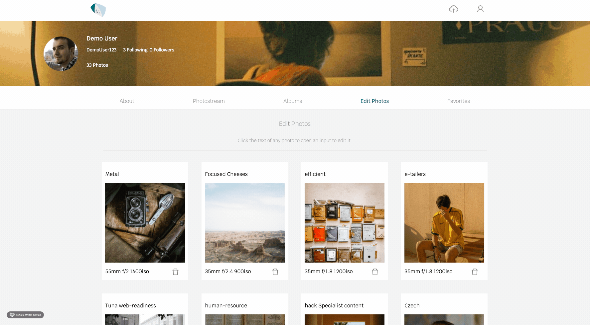

 

  

  <h3 align="center">F/r</h3>

  

    <a href="https://fslashr.herokuapp.com/" target="_blank"><strong>Explore the website »</strong></a>
     
     
  

<!-- TABLE OF CONTENTS -->

  
Table of Contents

  <ol>
    <li>
      <a href="#about-the-project">About The Project</a>
      <ul>
        <li><a href="#built-with">Built With</a></li>
      </ul>
    </li>
    <!-- <li><a href="#usage">Usage</a></li> -->
    <li>
      <a href="#interesting-issues">Interesting Issues</a>
    </li>
    <li>
      <a href="#features-to-implement-next">Features to Implement Next</a>
    <li><a href="#contact">Contact</a></li>
    </li>
  </ol>

<!-- ABOUT THE PROJECT -->
## About The Project 
[Back to top](#table-of-contents)

 

### [F/r](https://fslashr.herokuapp.com/)

F/r is a website built for people who have a passion for film photography. Users can upload photos with captions and the camera settings used for the photograph being uploaded. F/r allows users to scroll through 500+ film photos and create collections of ones you have loved to view later. Users can also greate albums to store photos they have taken.

### Built With 
[Back to top](#table-of-contents)
* [AWS - Amazon Web Services](https://aws.amazon.com/)
* [PostgreSQL](https://www.postgresql.org/docs/)
* [Sequelize](https://sequelize.org/)
* [ExpressJS](https://expressjs.com/)
* [React](https://reactjs.org/)
* [Redux](https://redux.js.org/)

## Usage
Users can see a feed of some of the most recent photos. From this page user's can view photos, like photos, and go to other user's pages.

 

 

Users can view a photostream of their published photos, and they can also see a photostream of all of the photos that they have favorited.

 

 

Users can create a new album. On this page, users can create a title and select any photos that they wish to add to that album.

 

 

Users can edit existing albums. On this page users can update the album's title, remove old photos from the album, and add new photos to the album.

 

 

Users can edit the information for each individual photo. The user can do this by simply clicking on the information they wish the edit. They may also delete the photo from this page.

 

 

On this page users can view an individual photo's information. The user that posted it, allowing them to follow or unfollow that user. They can also favorite the photo, or see the comments. When the comments tab is open, they may add a comment or delete comments they have written on that photo.

 

## Interesting Issues:
### Deletion and Addition of photos in Album Edit
[Back to top](#table-of-contents) 

<b>Issue</b>: Was having a hard to visualizing the UI of the album edit functionality. Users needed to be able to add and delete photos from an album simultaneously.

<b>Solution</b>: I ended up creating two seperate useStates, one for the addition of photos, and one for the removal of photos. As a user clicks photos through this page, it will detect whether it has been added or not, and remove/add it to the appropriate useState array. Upon completion both arrays will be send to the API to persist these changes to the database. As for the UI, I wanted something sleek and easy to understand. I did this by having photos that are already in, or have been selected, have 100% opacity, more shadow, and growing the size a bit. Conversely, when a photo is not selected, they would have 50% opacity, less shadow, and shrink.

## Features to Implement Next
[Back to top](#table-of-contents)

<b>Overview</b>:

### <b>Feature</b>: Drag and Drop for photo uploads
<b>How I would do it</b>: I will do this by utilizing the React-DnD package. This will allow users to drag and drop the photos they wish to upload, and it will allow the user to see the photo before submitting.

### <b>Feature</b>: User Info popup
<b>How I would do it</b>: I will do this by filling my redux feed slice of state with a bit more information on the owner of each photo. When a user hovers over the name of a photo card, I will set the visibility of a relatively positioned div to visible, revealing some of the other photos that user has uploaded, and allowing the user to follow the other user from this container.

<!-- CONTACT -->
## Contact
[Back to top](#table-of-contents)

Jordan Guevara - [LinkedIn](https://www.linkedin.com/in/jordan-guevara-a9370521a/) - jordansacct@gmail.com

Project Repo Link: [https://github.com/Jguevara1208/fslashr](https://github.com/Jguevara1208/fslashr)

Project Link: [https://fslashr.herokuapp.com/](https://fslashr.herokuapp.com/)

